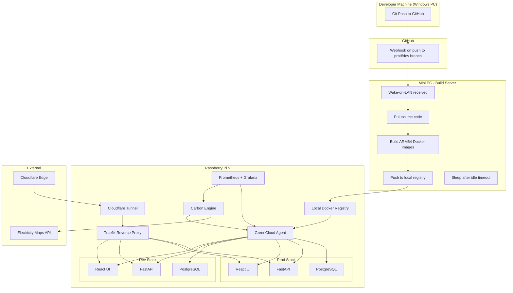

# GreenCloud - Implementation Plan

## Problem Statement

Build a personal cloud platform on a Raspberry Pi that lets you deploy a full-stack app (PostgreSQL + FastAPI + React) with a git-push workflow, running dev and prod environments on a single Pi, publicly accessible via Cloudflare Tunnel, with a carbon-aware scheduling layer powered by Electricity Maps data.

## Requirements

- Hardware: Pi 5 (8GB) + Mini PC build server + gigabit switch (to be procured)
- Dev and prod as separate Docker Compose stacks on one Pi
- `git push` to prod branch auto-deploys; dev/test toggled manually
- Mini PC builds ARM64 images, sleeps when idle (Wake-on-LAN)
- Local Docker registry, Traefik reverse proxy, Cloudflare Tunnel
- Carbon-aware scheduling via Electricity Maps average intensity API
- Single Pi now, designed to scale to multiple nodes
- GitHub for source code + webhooks

## Architecture

```
Git Push → GitHub Webhook → Mini PC wakes → Builds ARM64 image → Pushes to local registry → Pi agent pulls image → Restarts Compose stack → Traefik routes traffic → Cloudflare Tunnel serves publicly
```



## Key Design Decisions

| Decision | Choice | Rationale |
|----------|--------|-----------|
| Environment isolation | Separate Docker Compose stacks | Simple, no orchestrator overhead, easy to toggle dev on/off |
| Public ingress | Cloudflare Tunnel | No open ports, free HTTPS, no networking expertise needed |
| Carbon data source | Electricity Maps (average intensity) | Industry standard, compatible with reporting frameworks |
| Build location | Mini PC with Wake-on-LAN | Keeps Pi free for serving; Mini PC sleeps when not building |
| Image storage | Local Docker registry | Full control, no external dependency for deployments |
| Source control | GitHub | Free CI ecosystem, webhooks, no need to self-host git |
| Reverse proxy | Traefik | Docker-native, auto-discovery via labels, lightweight |
| Monitoring | Prometheus + Grafana + Loki | Industry standard, extensible, runs on ARM64 |

## Hardware Procurement List

| Item | Spec | Purpose | Est. Cost |
|------|------|---------|-----------|
| Raspberry Pi 5 | 8GB RAM | Compute node (runs all services) | ~£80 |
| NVMe HAT + 500GB SSD | PCIe NVMe | Fast storage for containers and DB | ~£60 |
| Official Pi 5 PSU | 27W USB-C | Stable power for Pi | ~£12 |
| Mini PC | i5 8th Gen+, 16GB RAM (Lenovo Tiny/Dell OptiPlex/HP EliteDesk) | Build server | ~£150-200 |
| 8-port Gigabit switch | Unmanaged | Local network | ~£20 |
| Ethernet cables | Cat6 | Wired connections | ~£10 |
| Smart plug (optional) | WiFi, energy monitoring | Measure Mini PC power | ~£15 |
| USB power meter (optional) | Inline USB-C | Measure Pi power draw | ~£15 |

**Estimated total: £360-410**

## Task Breakdown (Summary)

1. Project scaffolding and documentation
2. Docker Compose stacks for full-stack app (runnable on Windows)
3. Local Docker Registry
4. CI/CD pipeline — GitHub webhook receiver and build orchestration
5. Deployment agent and stack orchestration
6. Traefik + Cloudflare Tunnel integration
7. Observability stack (Prometheus + Grafana + Loki)
8. Carbon Engine — Electricity Maps integration and energy dashboard
9. Hardware setup and migration to real infrastructure
10. Polish — CLI, RBAC, blue/green deployments

Each task has a detailed breakdown in its own file: `task-XX-*.md`

## Documentation Structure (Target)

```
/docs/architecture    - System design diagrams and component descriptions
/docs/adr            - Architecture Decision Records
/docs/api            - API reference docs (OpenAPI)
/docs/runbooks       - Operational procedures
/docs/sustainability - Carbon methodology and reporting
```
