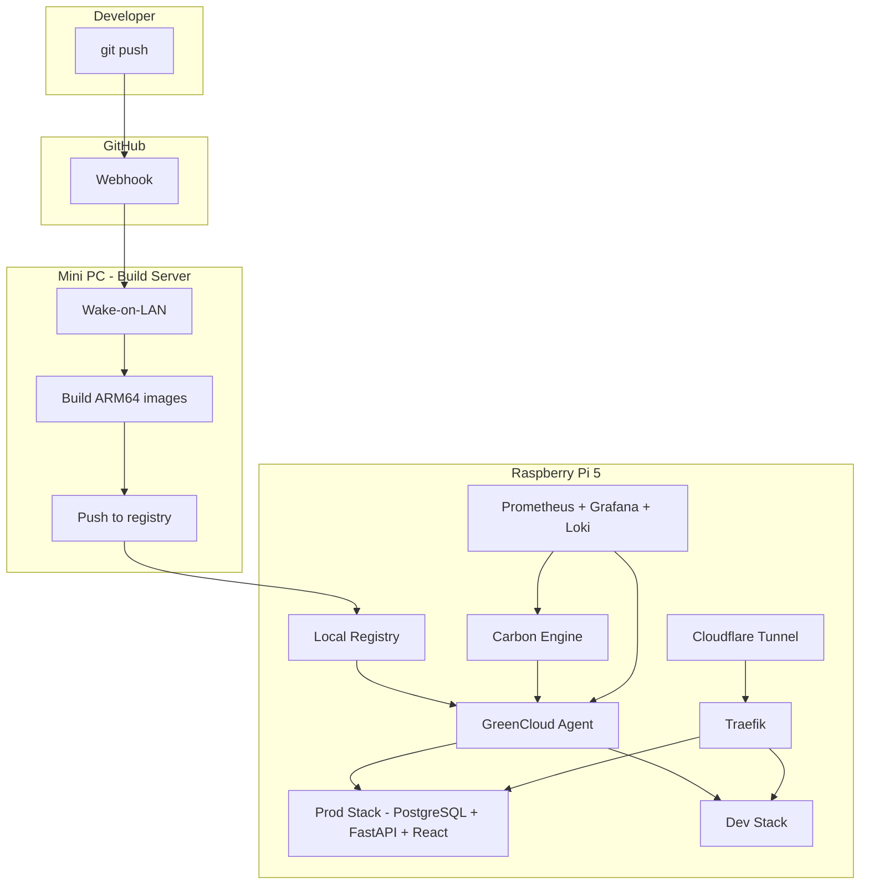

# GreenCloud

A carbon-aware self-hosted Platform-as-a-Service (PaaS) running on a Raspberry Pi 5 with an on-demand Mini PC build server. Deploy full-stack applications with a git-push workflow while tracking and minimising energy usage.

**Live:** [green-cloud.uk](https://green-cloud.uk)

## What's Running

| Service | URL | Description |
|---------|-----|-------------|
| Landing Page | [green-cloud.uk](https://green-cloud.uk) | Service directory |
| Application | [app.green-cloud.uk](https://app.green-cloud.uk) | Deployment dashboard |
| Carbon Engine | [carbon.green-cloud.uk](https://carbon.green-cloud.uk/docs) | Emissions and grid intensity API |
| Grafana | [grafana.green-cloud.uk](https://grafana.green-cloud.uk) | Metrics and dashboards |
| GreenCloud API | [api.green-cloud.uk](https://api.green-cloud.uk/docs) | Deployment management |

## Architecture



## Quick Start

```bash
# Clone
git clone https://github.com/mattygibson/green-cloud.git
cd green-cloud

# Copy environment config
cp infra/.env.example infra/.env

# Start infrastructure (Traefik, registry, monitoring, carbon engine)
docker compose -f infra/docker-compose.infra.yml up -d

# Start the production app
docker compose -f infra/docker-compose.prod.yml up -d --build
```

Access at: `http://app.localhost`

For full setup details: [docs/how-to-guide.md](docs/how-to-guide.md)

## CLI

```bash
cd services/cli
uv run python -m greencloud.cli status
uv run python -m greencloud.cli carbon
uv run python -m greencloud.cli deploy list
```

See [services/cli/README.md](services/cli/README.md) for all commands.

## Project Structure

```
green-cloud/
├── docs/               # Architecture docs, ADRs, runbooks
├── services/           # Application code
│   ├── greencloud-api/ # Deployment management API
│   ├── agent/          # Node agent (container management)
│   ├── carbon-engine/  # Carbon-aware scheduling + Electricity Maps
│   ├── cli/            # Command-line tool (Typer + Rich)
│   └── app/            # Full-stack app (API + UI + DB + Landing)
├── infra/              # Docker Compose, Traefik, Prometheus, Grafana
└── scripts/            # Utility scripts
```

## Features Implemented

- [x] Full-stack app (React + FastAPI + PostgreSQL)
- [x] Docker Compose stacks (prod + dev + infra)
- [x] Local Docker registry
- [x] CI/CD pipeline (GitHub webhooks + build orchestration)
- [x] Deployment agent with health checking
- [x] Traefik reverse proxy with automatic routing
- [x] Cloudflare Tunnel (zero open ports)
- [x] Prometheus + Grafana + Loki observability
- [x] Carbon Engine (Electricity Maps + emissions tracking)
- [x] Carbon-aware scheduling (defer builds when grid is dirty)
- [x] CLI tool (Typer + Rich)
- [x] API key authentication (RBAC: admin/deployer/viewer)
- [x] Landing page + deployment dashboard UI

## Waiting on Hardware

- [ ] Raspberry Pi 5 setup and migration
- [ ] Mini PC Wake-on-LAN build pipeline
- [ ] Blue/green zero-downtime deployments
- [ ] USB power meter for real measurements

## Key Design Decisions

- [ADR-001](docs/adr/ADR-001-environment-isolation.md) — Docker Compose for environment isolation
- [ADR-002](docs/adr/ADR-002-public-ingress.md) — Cloudflare Tunnel for public ingress
- [ADR-003](docs/adr/ADR-003-carbon-data-source.md) — Electricity Maps for carbon data
- [ADR-004](docs/adr/ADR-004-build-strategy.md) — Cross-compile on Mini PC with Wake-on-LAN

## Documentation

- [How-to Guide](docs/how-to-guide.md) — Getting started
- [Test Plan](docs/test-plan.md) — Verification steps
- [Carbon Methodology](docs/sustainability/methodology.md) — How emissions are calculated
- [Cloudflare Tunnel Setup](docs/runbooks/cloudflare-tunnel-setup.md) — Domain + tunnel config
- [Domain Setup Record](docs/runbooks/domain-and-tunnel-setup.md) — What was actually done
- [Architecture Decisions](docs/adr/) — ADRs

## Status

**Software complete** — all services running on Windows dev machine via Docker. Waiting on Raspberry Pi 5 and Mini PC hardware to deploy to production.

Domain: [green-cloud.uk](https://green-cloud.uk) (live via Cloudflare Tunnel from dev machine)
