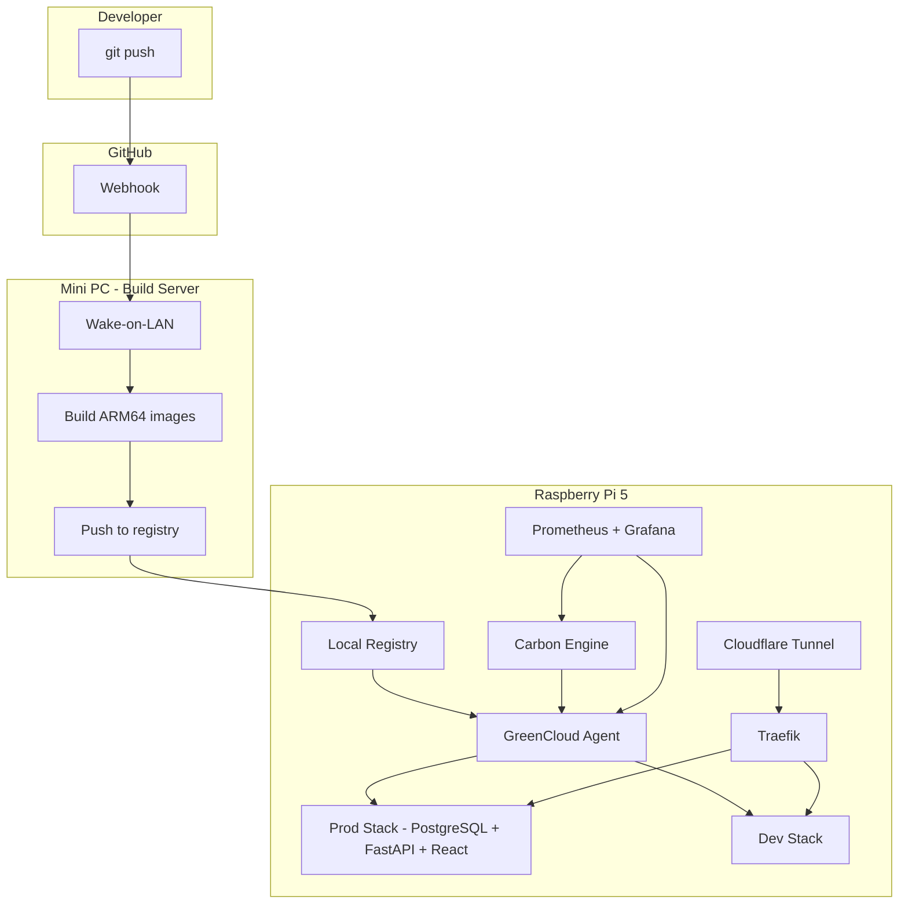

# GreenCloud

A carbon-aware self-hosted Platform-as-a-Service (PaaS) running on a Raspberry Pi 5 with an on-demand Mini PC build server. Deploy full-stack applications with a git-push workflow while tracking and minimising energy usage.

## Architecture



## How It Works

1. Push code to GitHub
2. Webhook triggers the GreenCloud API
3. Mini PC wakes up, builds ARM64 Docker images
4. Images are pushed to the local registry on the Pi
5. The agent pulls new images and restarts the appropriate stack
6. Traefik routes traffic; Cloudflare Tunnel exposes it publicly
7. Carbon Engine tracks energy usage and grid intensity

## Hardware

| Item | Spec | Purpose |
|------|------|---------|
| Raspberry Pi 5 | 8GB RAM, NVMe SSD | Compute node (runs all services) |
| Mini PC | i5 8th Gen+, 16GB RAM | Build server (sleeps when idle) |
| 8-port Gigabit Switch | Unmanaged | Local network |
| Smart Plug | WiFi, energy monitoring | Measure Mini PC power (optional) |
| USB Power Meter | Inline USB-C | Measure Pi power (optional) |

## Project Structure

```
green-cloud/
├── docs/           # Architecture docs, ADRs, runbooks
├── services/       # Application code
│   ├── greencloud-api/   # Deployment management API
│   ├── agent/            # Node agent (container management)
│   ├── carbon-engine/    # Carbon-aware scheduling
│   └── app/              # Sample full-stack app (API + UI + DB)
├── infra/          # Docker Compose, Traefik, Cloudflare config
└── scripts/        # Utility scripts
```

## Key Design Decisions

- [ADR-001](docs/adr/ADR-001-environment-isolation.md) — Docker Compose for environment isolation
- [ADR-002](docs/adr/ADR-002-public-ingress.md) — Cloudflare Tunnel for public ingress
- [ADR-003](docs/adr/ADR-003-carbon-data-source.md) — Electricity Maps for carbon data
- [ADR-004](docs/adr/ADR-004-build-strategy.md) — Cross-compile on Mini PC with Wake-on-LAN

## Quick Start

> Coming soon — hardware setup and initial deployment guides are in progress.

## Documentation

- [Architecture Decisions](docs/adr/)
- [Hardware Procurement](docs/runbooks/hardware-procurement.md)
- [Project Blueprint](docs/plan/greencloud-project-blueprint.md)

## Status

🚧 **In Development** — Currently in the scaffolding and planning phase.
