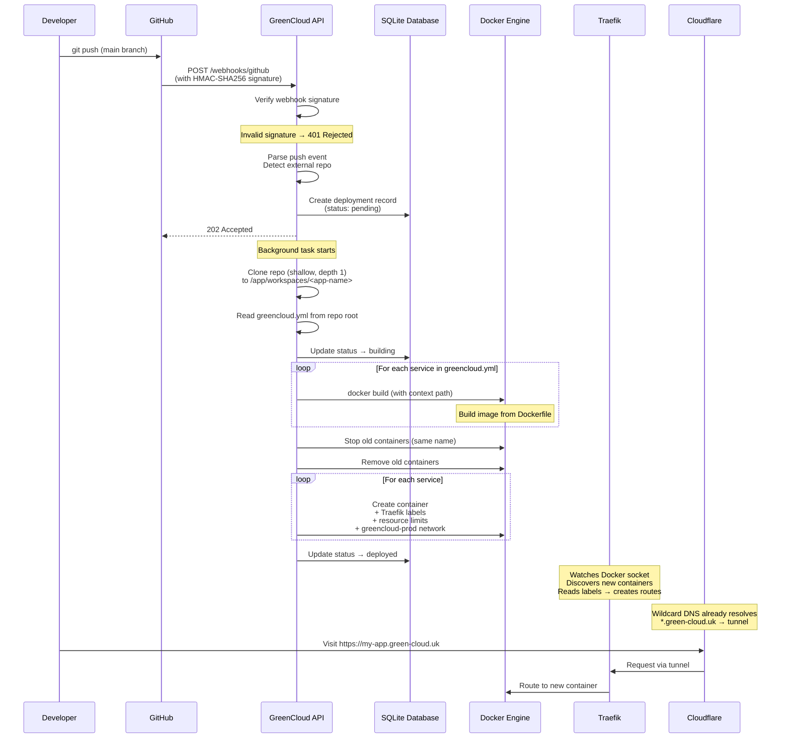
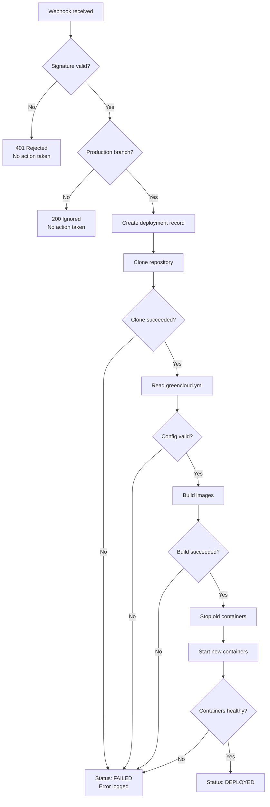

# Deployment Pipeline Flow

This document explains how code goes from a `git push` to a running application on GreenCloud. There are two ways to trigger a deployment — webhook (automatic) and manual — but both use the same underlying pipeline.

## Deployment Sequence Diagram



## Step-by-Step Explanation

### 1. Developer pushes code

A developer pushes a commit to the `main` (or `master` or `prod`) branch of their GitHub repository.

### 2. GitHub fires a webhook

GitHub is configured to send a POST request to `https://api.green-cloud.uk/webhooks/github` whenever a push event occurs. The request includes:
- The full push event payload (repository name, branch, commit SHA, etc.)
- An `X-Hub-Signature-256` header containing an HMAC-SHA256 signature of the payload

### 3. Signature validation

The GreenCloud API verifies the webhook is genuinely from GitHub:
- Computes HMAC-SHA256 of the raw request body using the shared secret
- Compares it against the provided signature using constant-time comparison (prevents timing attacks)
- If they don't match → 401 Unauthorized, request is rejected

### 4. Event classification

The API determines:
- Is this a push event? (ignores other GitHub event types)
- Is this an external repository? (not the green-cloud repo itself)
- Is this a production branch? (main/master/prod — ignores feature branches)

### 5. Deployment record created

A record is stored in the SQLite database with:
- Repository URL and name
- Branch and commit SHA
- Status: `pending`
- Trigger: `webhook`
- Timestamp

The API immediately returns `202 Accepted` to GitHub so the webhook doesn't time out.

### 6. Background deployment begins

A background task runs the deployment pipeline asynchronously:

**Clone the repository:**
```
git clone --depth 1 <repo-url> /app/workspaces/<app-name>
```
Shallow clone (depth 1) means only the latest commit is downloaded — fast and lightweight.

**Read greencloud.yml:**
The platform looks for a `greencloud.yml` file in the repository root. This file declares:
- Service names
- Build context paths (where the Dockerfile is)
- Resource limits
- Subdomain routing

### 7. Build images

For each service defined in `greencloud.yml`:
- Run `docker build` with the specified context path
- Tag the resulting image appropriately

### 8. Replace old containers

If containers with the same name already exist (from a previous deployment):
- Stop them gracefully
- Remove them

This means the old version keeps running until the new one is built. If the build fails, the old version stays up.

### 9. Create new containers

For each service:
- Create a new container from the freshly built image
- Attach Traefik labels (routing rules, subdomain, port)
- Set resource limits (memory, CPU)
- Connect to the `greencloud-prod` network

### 10. Update deployment status

The database record is updated to `deployed` (or `failed` if something went wrong).

### 11. Traefik auto-discovers the new containers

Traefik watches the Docker socket in real time. When new containers appear with `traefik.enable=true` labels, it automatically:
- Reads the routing rules from labels
- Creates the route (no restart needed, no config file changes)
- Starts sending matching traffic to the new container

### 12. DNS already resolves

Cloudflare has a wildcard DNS record: `*.green-cloud.uk` → Cloudflare Tunnel. This means any subdomain immediately resolves without additional DNS configuration.

### 13. App is live

The app is now accessible at `https://<subdomain>.green-cloud.uk`. The full request path is:
```
Browser → Cloudflare Edge → Tunnel → Traefik → Container
```

## Error Handling



### Key safety properties:

- **Build fails?** Old containers are never removed until new images are successfully built. The previous version keeps running.
- **Clone fails?** Deployment record is marked as failed. Nothing else happens.
- **Invalid signature?** Request is rejected immediately. No deployment is triggered.
- **Non-production branch?** Webhook is acknowledged but no deployment runs.
- **Container won't start?** Status is marked as failed, logged for debugging.

## Webhook Deploy vs Manual Deploy

Both triggers use the same deployment pipeline — the difference is just how it starts.

| Aspect | Webhook Deploy | Manual Deploy |
|--------|---------------|---------------|
| **Trigger** | GitHub sends POST to `/webhooks/github` | User calls POST to `/deploy` or uses dashboard |
| **Authentication** | HMAC-SHA256 signature from GitHub | API key |
| **When it happens** | Automatically on push to main/prod | When you choose |
| **Payload source** | GitHub push event (repo URL, branch, SHA) | User provides repo URL |
| **Pipeline** | Same build → deploy → route pipeline | Same build → deploy → route pipeline |
| **Use case** | Continuous deployment (push = deploy) | First-time setup, re-deploys, debugging |

### Why both?

- **Webhook** gives you push-to-deploy: commit → merge → live in minutes with no manual steps
- **Manual** is useful for initial setup, deploying a specific commit, or re-deploying after fixing infrastructure issues

## The greencloud.yml File

Every app deployed via GreenCloud needs a `greencloud.yml` in its repository root. This tells the platform how to build and run the app.

```yaml
# Example greencloud.yml
name: meal-planner
subdomain: meal-planner

services:
  api:
    build:
      context: ./backend
    port: 8000
    path_prefix: /api
    resources:
      memory: 128m
      cpus: 0.25
    healthcheck:
      path: /health

  ui:
    build:
      context: ./frontend
    port: 80
    resources:
      memory: 64m
      cpus: 0.1
```

The platform reads this file to know:
- What subdomain to assign (becomes `<subdomain>.green-cloud.uk`)
- How many services to build and which Dockerfiles to use
- What port each service listens on
- How to route traffic (path prefixes differentiate API from UI)
- What resource limits to apply (important on the Pi's 8GB RAM)
- Where to send health checks
