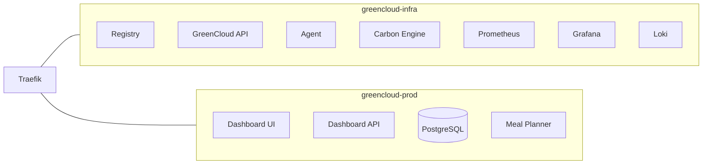
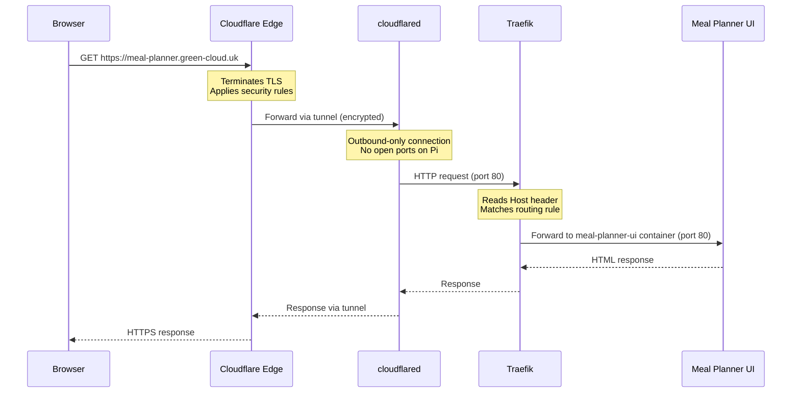

# High-Level System Design

This document describes the overall architecture of GreenCloud — a carbon-aware self-hosted PaaS running on a Raspberry Pi 5.

## Architecture Overview

```mermaid
graph TB
    subgraph Internet
        User[User / Browser]
        GitHub[GitHub]
    end

    subgraph Cloudflare["Cloudflare Edge"]
        CF_DNS[DNS + CDN]
        CF_Access[Cloudflare Access]
    end

    subgraph Pi["Raspberry Pi 5"]
        subgraph infra["greencloud-infra network"]
            Tunnel[cloudflared<br/>Tunnel Container]
            Traefik[Traefik<br/>Reverse Proxy]
            API[GreenCloud API<br/>FastAPI]
            Agent[GreenCloud Agent<br/>FastAPI]
            Carbon[Carbon Engine<br/>FastAPI]
            Registry[Docker Registry]
            Landing[Landing Page]
            Prometheus[Prometheus]
            Grafana[Grafana]
            Loki[Loki]
            Promtail[Promtail]
            NodeExporter[Node Exporter]
        end

        subgraph prod["greencloud-prod network"]
            ProdUI[Dashboard UI<br/>React + Nginx]
            ProdAPI[Dashboard API<br/>FastAPI]
            ProdDB[(PostgreSQL)]
            MealPlannerUI[Meal Planner UI]
            MealPlannerAPI[Meal Planner API]
            UserApps[Other User Apps...]
        end

        DockerSocket[/var/run/docker.sock]
    end

    subgraph MiniPC["Mini PC (Build Server)"]
        Builder[docker buildx<br/>ARM64 builds]
    end

    User -->|HTTPS| CF_DNS
    GitHub -->|Webhook POST| CF_DNS
    CF_DNS --> Tunnel
    Tunnel --> Traefik
    Traefik --> API
    Traefik --> Carbon
    Traefik --> Landing
    Traefik --> Grafana
    Traefik --> ProdUI
    Traefik --> ProdAPI
    Traefik --> MealPlannerUI
    Traefik --> MealPlannerAPI
    API --> DockerSocket
    Agent --> DockerSocket
    Traefik --> DockerSocket
    Builder -->|push images| Registry
    ProdAPI --> ProdDB
    API --> Registry
    Promtail --> Loki
    Prometheus --> NodeExporter
    Prometheus --> API
    Prometheus --> Carbon
    Prometheus --> Traefik
    Carbon -->|Electricity Maps API| Internet
```

## Component Table

| Component | Role | Technology | Port |
|-----------|------|------------|------|
| Cloudflare Edge | HTTPS termination, CDN, DDoS protection | Cloudflare DNS + CDN | — |
| Cloudflare Tunnel | Secure outbound-only connection from Pi to Cloudflare | `cloudflare/cloudflared` | — |
| Traefik | Reverse proxy — routes requests by hostname to correct container | Traefik v2.11 | 80, 8080, 8082 |
| GreenCloud API | Webhook receiver, deployment orchestration, app discovery | Python 3.12 + FastAPI | 8000 |
| GreenCloud Agent | Container management, system stats reporting | Python 3.12 + FastAPI | 8001 |
| Carbon Engine | Grid carbon intensity monitoring, emissions tracking, scheduling | Python 3.12 + FastAPI | 8002 |
| Docker Registry | Local container image storage | `registry:2` | 5000 |
| Landing Page | Static landing page at green-cloud.uk | Nginx | 80 |
| Dashboard UI | React frontend for managing deployments | React 18 + Vite + Nginx | 80 |
| Dashboard API | Backend for the dashboard, exposes deployment/app data | Python 3.12 + FastAPI | 8000 |
| PostgreSQL | Production database for the dashboard app | PostgreSQL 16 Alpine | 5432 |
| User Apps (e.g. Meal Planner) | Third-party apps deployed via the PaaS | Varies per app | Varies |
| Prometheus | Metrics collection and alerting | Prometheus v2.53 | 9090 |
| Grafana | Dashboards and visualisation | Grafana 11.1 | 3000 |
| Loki | Log aggregation | Grafana Loki 3.1 | 3100 |
| Promtail | Log shipping from Docker containers to Loki | Promtail 3.1 | — |
| Node Exporter | Hardware/OS metrics for Prometheus | Node Exporter v1.8 | 9100 |

## Network Topology

GreenCloud uses two Docker networks to isolate concerns:

### greencloud-infra (internal platform services)

Everything that makes the PaaS run lives here:
- Traefik (also connected to prod-net so it can route to both networks)
- GreenCloud API, Agent, Carbon Engine
- Docker Registry
- Landing page
- Cloudflare Tunnel (cloudflared)
- Full monitoring stack (Prometheus, Grafana, Loki, Promtail, Node Exporter)

### greencloud-prod (deployed applications)

Apps that serve end users live here:
- Dashboard UI + API + PostgreSQL
- User-deployed apps (Meal Planner, etc.)
- Any future apps deployed via the PaaS

### Why two networks?

Isolation. A user app running on `greencloud-prod` cannot reach the Docker Registry or Prometheus. Only Traefik bridges the two networks — it's connected to both, so it can route external traffic to any container regardless of which network it's on.



## Data Flow: External Request

Here's what happens when someone visits `meal-planner.green-cloud.uk`:



### Step by step:

1. **Browser** resolves `meal-planner.green-cloud.uk` via DNS → Cloudflare's edge IP
2. **Cloudflare** terminates TLS (provides the HTTPS certificate), applies security rules, caches static assets
3. **Cloudflare** sends the request through the tunnel to the `cloudflared` container on the Pi
4. **cloudflared** passes the request to Traefik on port 80
5. **Traefik** inspects the `Host` header, matches it against its routing rules (learned from Docker labels on running containers)
6. **Traefik** forwards to the correct backend container
7. Response flows back the same path

## Key URLs

| URL | Routes to | Access |
|-----|-----------|--------|
| `green-cloud.uk` | Landing page | Public |
| `app.green-cloud.uk` | Dashboard (React UI + API) | Public |
| `api.green-cloud.uk` | GreenCloud API (webhooks, deployments) | Public (API key for management endpoints) |
| `carbon.green-cloud.uk` | Carbon Engine | Public |
| `grafana.green-cloud.uk` | Grafana dashboards | Protected (Cloudflare Access) |
| `traefik.green-cloud.uk` | Traefik dashboard | Protected (Cloudflare Access) |
| `meal-planner.green-cloud.uk` | Meal Planner (example user app) | Public |
| `*.green-cloud.uk` | Any deployed app (wildcard DNS) | Public |

## Hardware

| Machine | Role | Specs |
|---------|------|-------|
| Raspberry Pi 5 | Production host — runs all containers | 8GB RAM, NVMe SSD, ARM64 |
| Mini PC | Build server — compiles Docker images for ARM64 | x86_64, used for cross-compilation via `docker buildx` |
| Windows PC | Development machine | Used for coding, local testing |

The Pi runs everything in production. The Mini PC handles CPU-intensive Docker builds (compiling for ARM64) and pushes finished images to the local registry. This keeps the Pi free for serving traffic.
