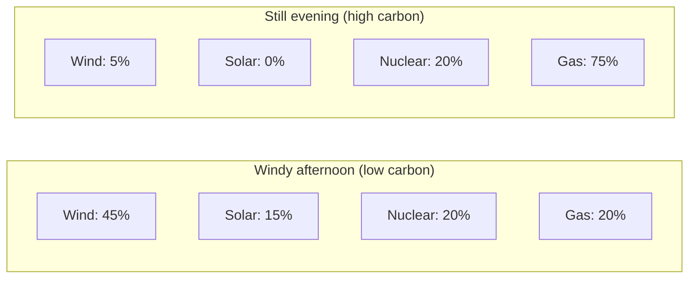
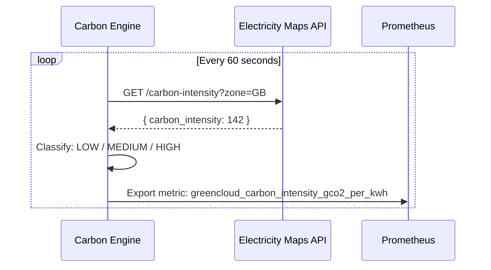
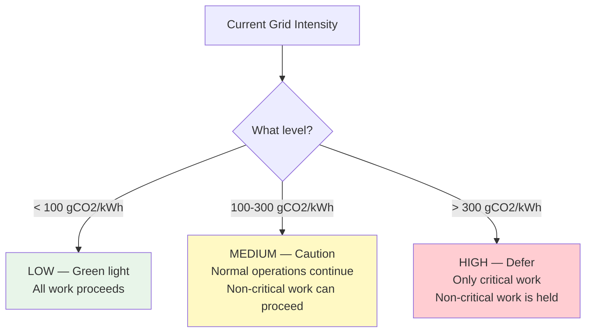
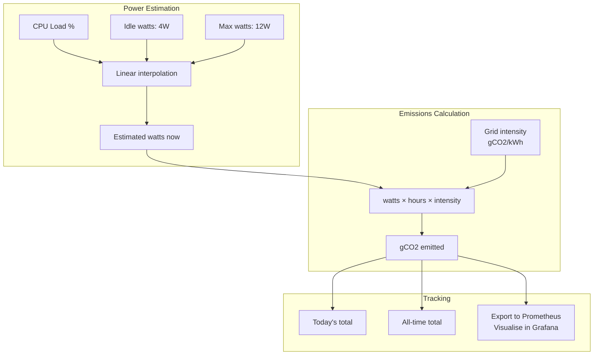

# Carbon-Aware Computing

This guide explains why computing has a carbon footprint, how the electricity grid works, and how GreenCloud uses real-time data to schedule work during cleaner periods.

## Why Does Computing Have a Carbon Footprint?

Computers use electricity. Generating electricity (in most places, most of the time) produces CO2. Therefore, every computation — every API request, every Docker build, every database query — has a carbon cost.

The chain looks like this:


A Raspberry Pi uses between 4 and 12 watts. That's tiny — a kettle uses 3000W. But the principle matters: if you can do the same work with less carbon, why wouldn't you?

## Grid Carbon Intensity

Here's the key insight: **not all electricity is equally dirty**.

The carbon intensity of electricity varies based on how it's being generated right now:

| Source | Carbon intensity (gCO2/kWh) | When it's used |
|--------|----------------------------|----------------|
| Wind | ~12 | When it's windy |
| Solar | ~45 | During the day |
| Nuclear | ~12 | Always (baseload) |
| Gas | ~450 | Peak demand, low renewables |
| Coal | ~900 | Rarely in UK, more in other countries |

The **grid carbon intensity** is the weighted average of all active sources at a given moment. In the UK (GreenCloud's location), this typically looks like:



At 2pm on a windy day, the grid might be 80 gCO2/kWh. At 7pm on a still winter evening, it might be 350 gCO2/kWh. Same computation, 4x the carbon footprint depending on when you do it.

## Electricity Maps API

[Electricity Maps](https://electricitymaps.com/) provides real-time carbon intensity data for electricity grids worldwide. Their API returns the current gCO2/kWh for a given zone.

GreenCloud's Carbon Engine calls this API every 60 seconds to get the current intensity for the GB (Great Britain) zone:



## GreenCloud's Carbon-Aware Scheduling

GreenCloud classifies the current grid state into three levels:



### What counts as critical vs non-critical?

| Work type | Classification | Reason |
|-----------|---------------|--------|
| Production deploys | Critical — always runs | Users are waiting, business impact |
| Webhook-triggered deploys | Critical — always runs | Developer pushed to prod |
| Dev environment builds | Non-critical — can be deferred | No urgency, developer can wait |
| Container cleanup tasks | Non-critical — can be deferred | Housekeeping, no user impact |
| Monitoring and metrics | Critical — always runs | Need visibility regardless of grid |
| Health checks | Critical — always runs | Must always know system status |

### The philosophy

GreenCloud never breaks a production deployment because of carbon intensity. The grid is dirty? Your prod deploy still goes through. But that dev build you kicked off? It can wait 30 minutes until the wind picks up.

This is "carbon-aware" not "carbon-blocked."

## Average vs Marginal Intensity

There are two ways to think about carbon intensity:

- **Average intensity:** The weighted average of all sources currently generating electricity. "What is the grid's overall carbon intensity right now?"
- **Marginal intensity:** The carbon intensity of the *next* unit of electricity that would be generated if demand increased. "If I turn on one more computer, what source would supply it?"

GreenCloud uses **average intensity** because:
- It's compatible with standard carbon reporting frameworks (GHG Protocol)
- It's simpler to measure and explain
- The difference matters more at industrial scale than for a 12W Raspberry Pi
- Marginal data is harder to get and more uncertain

## What GreenCloud Measures

### In scope

- Raspberry Pi power consumption (4-12W depending on load)
- Mini PC power consumption (when running builds)
- Estimated from load, not physically measured (the Pi doesn't have a power meter)

### Out of scope

These things also have a carbon footprint, but GreenCloud doesn't try to measure them:

- **GitHub's servers** — hosting your repository uses energy, but it's outside our control
- **Network transit** — data travelling across the internet uses energy at each hop
- **Manufacturing emissions** — making the Pi and Mini PC produced CO2
- **Your development machine** — the laptop you code on has its own footprint
- **Cloudflare's infrastructure** — their edge network uses energy

Being honest about scope prevents greenwashing. GreenCloud measures what it can measure and is transparent about the rest.

## Power Monitoring

The Carbon Engine tracks estimated power consumption:



The formula: **gCO2 = watts × hours × (gCO2/kWh)**

Example: Pi running at 8W for 1 hour when grid intensity is 200 gCO2/kWh:
```
8W × 1h = 0.008 kWh
0.008 kWh × 200 gCO2/kWh = 1.6 gCO2
```

That's 1.6 grams of CO2. For context, a single Google search is estimated at about 0.2g. Breathing out produces about 200g per hour. The Pi's footprint is small — but tracking it teaches you how to think about carbon in computing.

## The Bigger Picture

GreenCloud's carbon awareness isn't about saving the planet with one Raspberry Pi. It's about:

1. **Learning the concepts** — understanding grid intensity, carbon accounting, and scheduling trade-offs
2. **Building the tooling** — creating a system that could scale to larger infrastructure
3. **Making informed decisions** — knowing when your infrastructure is running clean vs dirty
4. **Demonstrating the approach** — showing that carbon-aware computing is practical, not just theoretical

The same principles GreenCloud uses at 12W could apply to a data center at 12MW:
- Monitor grid intensity
- Classify work by urgency
- Defer what can be deferred
- Always measure and report honestly

## The Carbon Dashboard

Grafana displays real-time carbon data:

- Current grid intensity (with colour coding: green/amber/red)
- Power consumption over time
- Cumulative emissions (today, this week, all-time)
- Carbon status (LOW/MEDIUM/HIGH)
- Number of builds deferred due to high carbon

This makes the invisible visible. You can look at a graph and say "my infrastructure emitted 15 grams of CO2 today, and the grid was clean for 18 of 24 hours."

## Summary

- **Grid carbon intensity** varies throughout the day depending on energy sources
- **Electricity Maps API** provides real-time intensity data for your region
- **GreenCloud schedules work** based on current intensity:
  - Low carbon → everything runs freely
  - High carbon → defer non-critical work, critical work proceeds
- **Average intensity** is used for calculations (compatible with reporting standards)
- **Scope is honest:** measures Pi and Mini PC energy, doesn't claim to measure what it can't
- The Pi uses 4-12W — the footprint is tiny, but the principles apply at any scale
- The goal is **learning and demonstrating** carbon-aware computing, not achieving zero emissions from a single small computer
