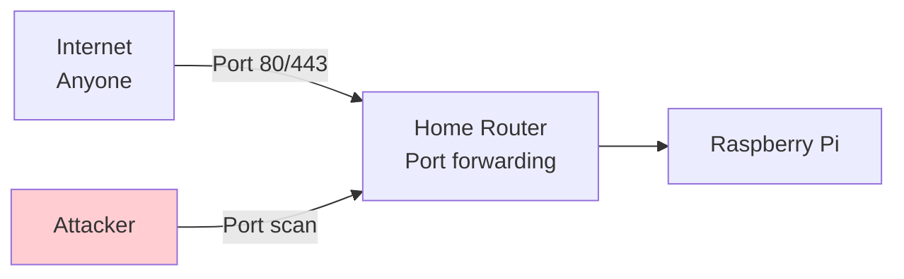
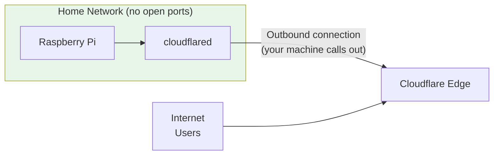
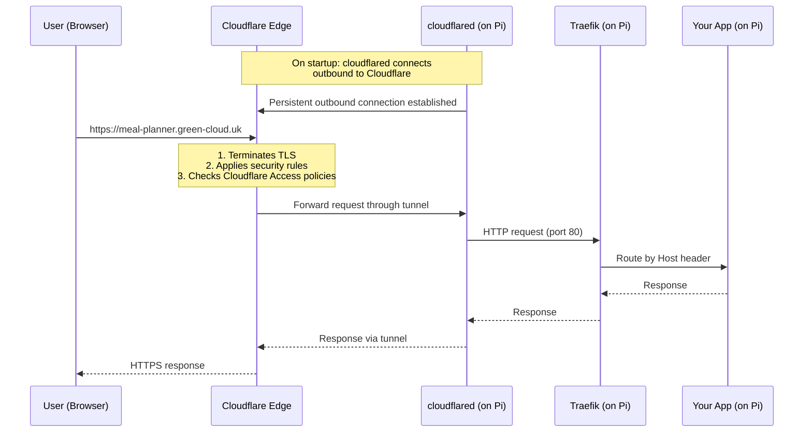
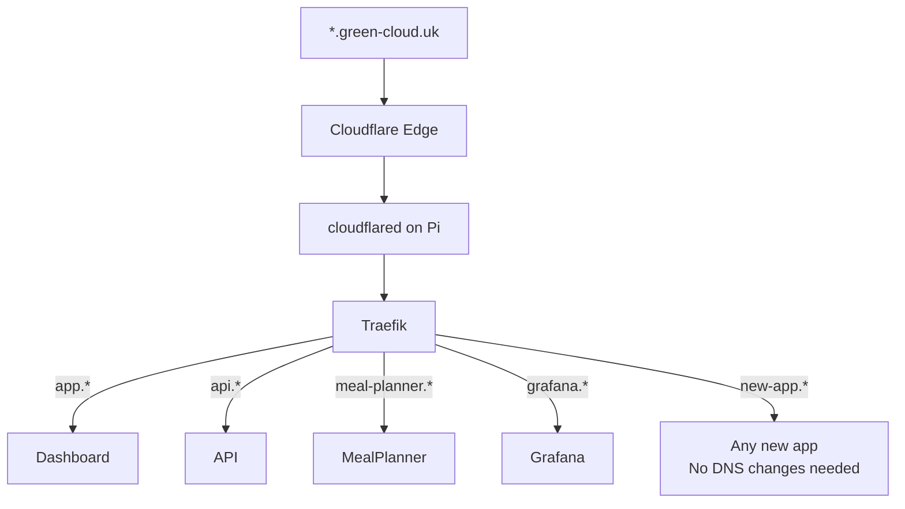
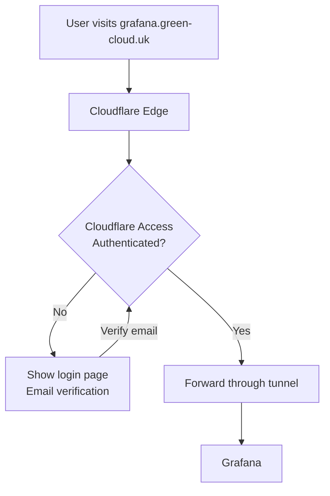

# Cloudflare Tunnel and Zero-Port Exposure

This guide explains how GreenCloud serves websites to the public internet from a Raspberry Pi at home — without opening any ports on the router, without a static IP, and without managing TLS certificates.

## The Traditional Way: Open Ports

Traditionally, if you want to host a website from home, you need to:

1. **Get a static IP** (or use dynamic DNS) so people can find your machine
2. **Open ports** on your router (port 80 for HTTP, 443 for HTTPS)
3. **Configure a firewall** to only allow the right traffic through
4. **Get TLS certificates** (Let's Encrypt) and renew them every 90 days
5. **Hope nobody port-scans you** and finds vulnerabilities



This works, but it exposes your home IP address, opens your network to attackers, and requires ongoing maintenance.

## The Cloudflare Tunnel Way: No Open Ports

Cloudflare Tunnel flips the model. Instead of opening inbound ports, your machine makes an **outbound connection** to Cloudflare:



Key difference: **nothing is listening on your home network**. The `cloudflared` container initiates an outbound connection to Cloudflare's servers and keeps it open. Traffic flows back through this same outbound tunnel.

No open ports. No port forwarding. No exposed home IP.

## How It Works Step by Step



### The steps:

1. **Startup:** The `cloudflared` container on the Pi connects outbound to Cloudflare's edge network. This is a long-lived connection that stays open.

2. **DNS:** Cloudflare manages your domain's DNS. When someone visits `*.green-cloud.uk`, DNS resolves to Cloudflare's edge servers (not your home IP — your IP is never revealed).

3. **Request arrives at Cloudflare:** A user visits `meal-planner.green-cloud.uk`. The request hits Cloudflare's edge (one of their 300+ data centers worldwide).

4. **TLS termination:** Cloudflare handles HTTPS. They provide the certificate, handle the encryption, and forward plain HTTP through the tunnel. You never need to manage certificates.

5. **Through the tunnel:** Cloudflare sends the request down the tunnel to your `cloudflared` container.

6. **To Traefik:** `cloudflared` forwards the request to Traefik on port 80.

7. **To your app:** Traefik routes by hostname to the correct container.

8. **Response flows back** through the same path in reverse.

## Wildcard Routing

GreenCloud uses a **wildcard DNS record**: `*.green-cloud.uk` → Cloudflare Tunnel.

This means every possible subdomain automatically resolves to Cloudflare, which routes it through the tunnel. When you deploy a new app with subdomain `my-app`, it's immediately accessible at `my-app.green-cloud.uk` without any DNS changes.



## HTTPS: Free and Automatic

Cloudflare provides TLS certificates for your domain at no cost:
- They issue and renew certificates automatically
- TLS is terminated at Cloudflare's edge (close to the user — lower latency)
- Traffic between Cloudflare and your tunnel is encrypted
- You never deal with Let's Encrypt, certbot, or certificate renewal

The connection looks like this:

```
User ←—HTTPS—→ Cloudflare ←—encrypted tunnel—→ cloudflared ←—HTTP—→ Traefik ←—HTTP—→ App
     (TLS cert)              (tunnel encryption)              (local only, never leaves Pi)
```

The last hop (Traefik → App) is unencrypted HTTP, but it's all inside the same machine on a Docker network. It never touches a physical network cable.

## Security Benefits

### No port scanning

Your router has no open ports. Attackers can't discover your services by scanning IP ranges because there's nothing listening.

### IP address hidden

Your home IP is never exposed. DNS resolves to Cloudflare's IPs, not yours. Even if someone knows your domain, they can't find your physical location from it.

### DDoS protection

If someone tries to flood your site with traffic, they're hitting Cloudflare's infrastructure — a global network designed to absorb massive traffic. Only legitimate requests make it through the tunnel.

### Cloudflare Access (for admin panels)

Some services (like Grafana and the Traefik dashboard) shouldn't be public. Cloudflare Access lets you add authentication in front of specific subdomains — users must log in via email verification before they even reach your tunnel.



## The cloudflared Container in GreenCloud

In `docker-compose.infra.yml`, the tunnel is defined as:

```yaml
cloudflared:
  image: cloudflare/cloudflared:latest
  container_name: greencloud-tunnel
  restart: unless-stopped
  command: tunnel run
  environment:
    TUNNEL_TOKEN: ${CLOUDFLARE_TUNNEL_TOKEN}
  networks:
    - infra-net
  depends_on:
    - traefik
  profiles:
    - tunnel
```

Key points:
- It uses the official Cloudflare image
- The `TUNNEL_TOKEN` authenticates it with your Cloudflare account
- It's on the `infra-net` network (can reach Traefik)
- It's in the `tunnel` profile — meaning it only starts when you explicitly enable it (for local development, you don't need the tunnel)

## Comparison: Traditional Hosting vs Cloudflare Tunnel

| Aspect | Traditional | Cloudflare Tunnel |
|--------|-------------|-------------------|
| Open ports | Yes (80, 443 minimum) | None |
| IP exposed | Yes (in DNS records) | No (hidden behind Cloudflare) |
| TLS certificates | Manual (Let's Encrypt + renewal) | Automatic (Cloudflare provides) |
| DDoS protection | None (or expensive third-party) | Built in |
| Router config | Port forwarding required | No changes needed |
| Static IP needed | Yes (or dynamic DNS) | No |
| Setup complexity | Moderate-to-high | Low (one token, one container) |
| Latency | Direct connection | Slight overhead (Cloudflare hop) |
| Cost | Free (but more work) | Free tier available |

## When Not to Use a Tunnel

Cloudflare Tunnel adds a small amount of latency (your traffic goes through Cloudflare's nearest edge node). For most web apps, this is invisible (a few milliseconds). But if you need:

- Ultra-low-latency connections (real-time gaming)
- Non-HTTP protocols (raw TCP/UDP)
- Local-only services (no internet access needed)

...then a tunnel isn't the right tool. For GreenCloud's use case (web apps served to the public), it's ideal.

## Summary

- **Cloudflare Tunnel** creates an outbound-only connection from your machine to Cloudflare's edge
- **No ports are opened** on your home network — nothing is exposed to port scanners
- **Your IP stays hidden** — DNS points to Cloudflare, not your home
- **TLS is free and automatic** — Cloudflare handles certificates
- **Wildcard DNS** means any new subdomain works instantly
- **Cloudflare Access** protects admin panels without any changes to your applications
- GreenCloud uses this to host a full PaaS from a Raspberry Pi at home, securely and with zero network configuration
