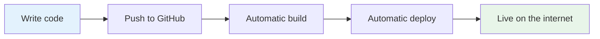
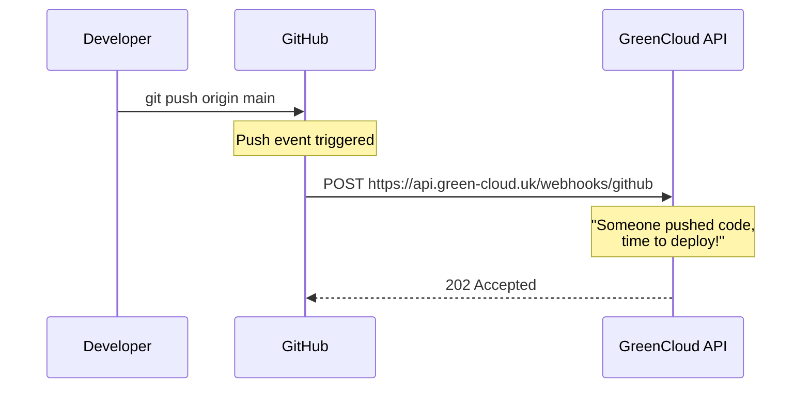
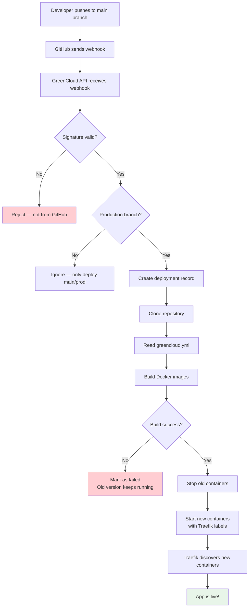
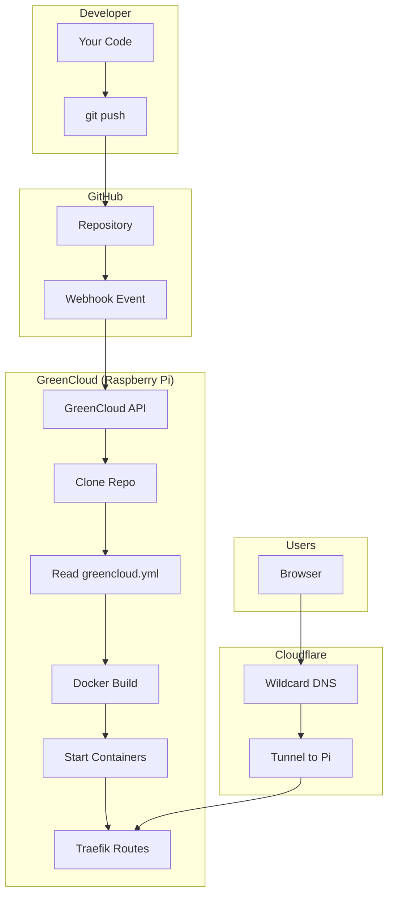

# How Push-to-Deploy Works

This guide explains how GreenCloud turns a `git push` into a running application — the same concept behind platforms like Heroku, Vercel, and Railway, but self-hosted on a Raspberry Pi.

## What is CI/CD?

CI/CD stands for **Continuous Integration / Continuous Deployment**. In plain terms:

- **Continuous Integration (CI):** Every time you push code, it's automatically tested and built. You don't manually run builds — the system does it for you.
- **Continuous Deployment (CD):** When the build succeeds, the new version is automatically deployed. You don't manually copy files to a server — the system handles it.

Together, they create a pipeline: code goes in one end, a running application comes out the other.



Without CI/CD, deploying looks like: build locally, SSH into server, stop old version, copy files, install dependencies, start new version, hope nothing breaks. With CI/CD, it's just `git push`.

## How GitHub Webhooks Work

A webhook is a way for one system to notify another when something happens. It's like a subscription — "Hey GitHub, whenever someone pushes code to this repo, call this URL."



The webhook POST request includes:
- Which repository was pushed to
- Which branch received the push
- The commit SHA (unique identifier of the exact code version)
- Who pushed it
- A cryptographic signature proving it really came from GitHub (not an impostor)

### Why the signature matters

Anyone could send a POST request to your webhook URL pretending to be GitHub. That's why GitHub signs every webhook with a secret key (HMAC-SHA256). GreenCloud verifies this signature before doing anything — if it doesn't match, the request is rejected.

## The GreenCloud Pipeline

Here's what happens when you push code to a repository configured for GreenCloud deployment:



### High-level summary:

1. **Trigger:** GitHub webhook arrives at the GreenCloud API
2. **Validate:** Verify the webhook is authentic (signature check)
3. **Clone:** Download the latest code from GitHub
4. **Configure:** Read `greencloud.yml` to learn how to build the app
5. **Build:** Create Docker images for each service
6. **Swap:** Stop old containers, start new ones
7. **Route:** Traefik auto-discovers new containers and routes traffic to them
8. **Live:** Wildcard DNS means the app is immediately accessible

For the detailed technical flow with every step, see [Deployment Pipeline Flow](../architecture/deployment-flow.md).

## The greencloud.yml File

Every app deployed through GreenCloud needs a `greencloud.yml` file in its repository root. This is equivalent to:
- Heroku's `Procfile`
- Vercel's `vercel.json`
- Railway's `railway.json`

It tells the platform: "Here's how to build and run my app."

```yaml
name: meal-planner
subdomain: meal-planner

services:
  api:
    build:
      context: ./backend
    port: 8000
    path_prefix: /api
    resources:
      memory: 128m
      cpus: 0.25
    healthcheck:
      path: /health

  ui:
    build:
      context: ./frontend
    port: 80
    resources:
      memory: 64m
      cpus: 0.1
```

### What each field means:

| Field | Purpose |
|-------|---------|
| `name` | Identifies the app (used in container names) |
| `subdomain` | The URL will be `<subdomain>.green-cloud.uk` |
| `services` | List of containers to build and run |
| `build.context` | Directory containing the Dockerfile |
| `port` | What port the service listens on inside the container |
| `path_prefix` | URL path routing (e.g. `/api` goes to the API service) |
| `resources` | Memory and CPU limits (important on a Pi with 8GB RAM) |
| `healthcheck.path` | Endpoint to verify the service is healthy |

## What Happens When Things Go Wrong

### Build fails (code doesn't compile, dependency issue)

The old version keeps running. GreenCloud only stops old containers after new images are successfully built. Your users see no downtime — they just keep using the previous version.

### Container won't start (app crashes on boot)

The deployment is marked as failed. The old containers were already removed (they're replaced during the swap step), but the error is logged so you can investigate.

### Webhook signature doesn't match

The request is rejected immediately with a 401. No deployment happens. This protects against someone sending fake webhooks to trigger unwanted deployments.

### Push to a non-production branch

Nothing happens. GreenCloud only deploys pushes to `main`, `master`, or `prod` branches. Feature branches are ignored — you develop and test those locally.

## Comparison to Platforms You Might Know

| Feature | Heroku | Vercel | Railway | GreenCloud |
|---------|--------|--------|---------|------------|
| Push-to-deploy | Yes | Yes | Yes | Yes |
| Config file | Procfile | vercel.json | railway.json | greencloud.yml |
| Build system | Buildpacks | Framework detection | Nixpacks | Docker |
| Infrastructure | AWS | Edge + Lambda | Shared cloud | Your Raspberry Pi |
| Custom domains | Yes | Yes | Yes | Yes (via Cloudflare) |
| Free tier | Limited | Generous | Generous | Unlimited (your hardware) |
| Data sovereignty | Their servers | Their servers | Their servers | Your home |
| Carbon tracking | No | No | No | Yes (core feature) |
| Cost at scale | $$$$ | Varies | Varies | Electricity bill |
| Vendor lock-in | Moderate | High | Moderate | None (it's just Docker) |

### GreenCloud's trade-offs:

**Advantages:**
- You own everything — no vendor lock-in, no surprise bills
- Full visibility into what's running and how much energy it uses
- Great for learning — you understand every layer

**Disadvantages:**
- You're responsible for maintenance (hardware, updates, backups)
- Single point of failure (one Pi, one location)
- Limited compute resources compared to cloud providers
- No automatic scaling (though Pi handles personal projects fine)

## The Full Picture

Here's how all the pieces fit together:



Everything from the push to users seeing the new version happens automatically in a few minutes. You write code, push it, and it's live.

## Summary

- **CI/CD** automates the build-and-deploy process — no manual steps after `git push`
- **Webhooks** are how GitHub tells GreenCloud that new code is ready
- **greencloud.yml** is your app's deployment config — tells the platform how to build and run it
- **Safety first:** old versions keep running until new ones are built and healthy
- GreenCloud is self-hosted Heroku — same developer experience, but on hardware you own, with full visibility into energy usage
