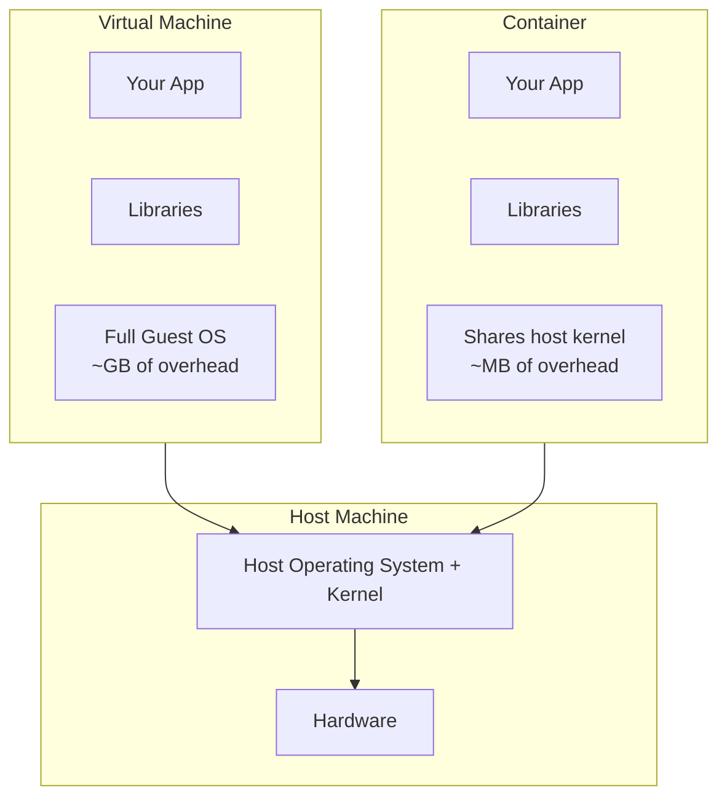
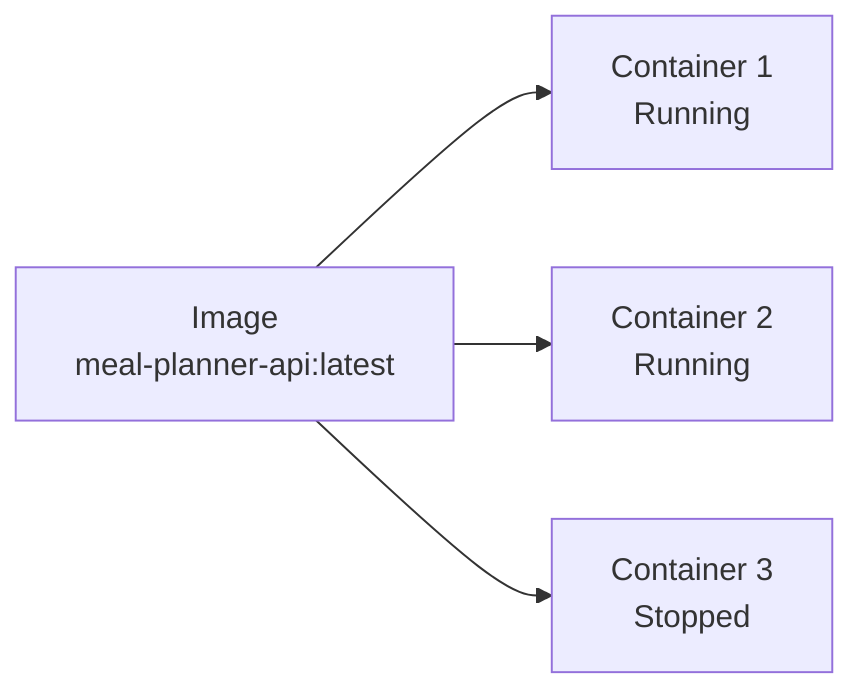
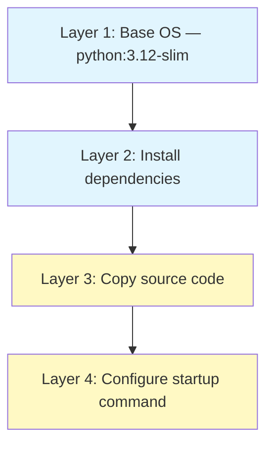

# What is Docker and Why We Use It

If you've written code before but haven't deployed it to a server, this guide explains the tool that makes it all possible.

## The Problem Docker Solves

Imagine you build a Python web app on your laptop. It works perfectly. You hand it to a friend and it crashes because they have a different Python version, missing libraries, or a different operating system.

Now multiply that by 15 services running on one small computer. Without isolation, they'd fight over ports, overwrite each other's files, and break when one gets updated.

Docker solves this by packaging your app and everything it needs into a self-contained unit called a **container**.

## Containers vs Virtual Machines

You might have heard of Virtual Machines (VMs). Containers solve a similar problem but in a lighter way:



| | Virtual Machine | Container |
|--|----------------|-----------|
| **Size** | Gigabytes (includes full OS) | Megabytes (just your app + dependencies) |
| **Startup time** | Minutes | Seconds |
| **Isolation** | Complete (separate kernel) | Process-level (shares host kernel) |
| **Resource usage** | Heavy | Lightweight |
| **Use case** | Running a different OS entirely | Running many apps on one machine |

For GreenCloud, we run 15+ services on a Raspberry Pi with 8GB of RAM. VMs would be impossible. Containers make it work.

## Key Concepts

### Image

An image is a **read-only blueprint** for a container. Think of it like a class in programming — it defines what the container will look like, but isn't running yet.

An image contains:
- A base operating system (usually a slim Linux like Alpine)
- Your application code
- All dependencies and libraries
- Configuration for how to start the app

### Container

A container is a **running instance** of an image. Like an object instantiated from a class.

You can run multiple containers from the same image (like having 3 copies of your API running for load balancing).



### Dockerfile

A Dockerfile is the **recipe** for building an image. It's a text file with step-by-step instructions:

```dockerfile
# Start from a Python base image
FROM python:3.12-slim

# Set working directory inside the container
WORKDIR /app

# Copy dependency file first (for caching)
COPY requirements.txt .

# Install dependencies
RUN pip install -r requirements.txt

# Copy your application code
COPY . .

# Tell Docker which port the app listens on
EXPOSE 8000

# Command to run when the container starts
CMD ["uvicorn", "app.main:app", "--host", "0.0.0.0", "--port", "8000"]
```

Each line creates a **layer**. Docker caches layers, so if you only change your code (last `COPY`), it doesn't need to reinstall all your dependencies again.

### Layers and Caching

Docker images are built in layers, stacked on top of each other:



If layers 1-2 haven't changed (same dependencies), Docker reuses the cached version and only rebuilds layers 3-4. This makes rebuilds fast — seconds instead of minutes.

### Volumes

Containers are **ephemeral** — when you delete a container, all data inside it is lost. If your app stores data (like a database), you need a **volume**.

A volume is persistent storage that lives outside the container and survives restarts:

```
Container (temporary)          Volume (permanent)
┌─────────────────┐           ┌──────────────────┐
│  PostgreSQL     │──mount──→│  /var/lib/data    │
│  process        │           │  (on host disk)   │
└─────────────────┘           └──────────────────┘
```

In GreenCloud, the PostgreSQL database stores its files in a volume called `prod-db-data`. If the container crashes and restarts, all your data is still there.

### Networks

By default, containers are isolated from each other — they can't communicate. Docker **networks** let you control which containers can talk.

In GreenCloud:
- Containers on `greencloud-infra` can reach each other (API, registry, monitoring)
- Containers on `greencloud-prod` can reach each other (dashboard, user apps)
- Containers on different networks **cannot** reach each other (user apps can't access the registry)
- Traefik is connected to both networks (it needs to route traffic to everything)

### Health Checks

A container can be "running" but the app inside might have crashed. A **health check** tells Docker how to verify the app is actually working:

```yaml
healthcheck:
  test: ["CMD-SHELL", "wget --spider http://127.0.0.1:8000/health"]
  interval: 10s
  timeout: 3s
  retries: 3
```

This pings `/health` every 10 seconds. If it fails 3 times in a row, Docker marks the container as `unhealthy`. Other services can wait for a container to be healthy before starting (like an API waiting for the database).

## Docker Compose

Running one container is simple: `docker run ...`. But GreenCloud has 15+ containers that need to:
- Start in the right order
- Share networks
- Mount the right volumes
- Have the right environment variables

**Docker Compose** lets you define all of this in a single YAML file:

```yaml
services:
  api:
    build: ./backend
    ports:
      - "8000:8000"
    depends_on:
      db:
        condition: service_healthy
    networks:
      - app-net

  db:
    image: postgres:16-alpine
    volumes:
      - db-data:/var/lib/postgresql/data
    networks:
      - app-net
    healthcheck:
      test: ["CMD-SHELL", "pg_isready"]

volumes:
  db-data:

networks:
  app-net:
```

Then one command brings everything up: `docker compose up`. One command tears everything down: `docker compose down`.

## How GreenCloud Uses Docker

Every component in GreenCloud runs as a Docker container:

| What | Why containerised |
|------|------------------|
| GreenCloud API | Isolate from other services, control resources |
| Carbon Engine | Independent service with its own dependencies |
| PostgreSQL | Data lives in a volume, easy to backup/restore |
| Traefik | Needs Docker socket access, but nothing else |
| User apps (Meal Planner, etc.) | Complete isolation — one app can't affect another |
| Monitoring (Prometheus, Grafana) | Standard images, easy to update |

### Isolation in practice

If you deploy a Meal Planner app and it has a memory leak, it can only use the memory you've allocated to its container (e.g. 128MB). It can't starve the database or crash other services. Docker enforces these limits at the operating system level.

### Reproducibility

The exact same container image runs in development and production. There's no "works on my machine" — if it builds, it runs the same everywhere.

### Portability

GreenCloud runs on a Raspberry Pi (ARM64 architecture). Docker images can be built for any architecture. The Mini PC (x86_64) cross-compiles ARM64 images using `docker buildx`, pushes them to the local registry, and the Pi pulls and runs them.

## Common Docker Commands

```bash
# Build an image from a Dockerfile in the current directory
docker build -t my-app:latest .

# Run a container from an image
docker run -d --name my-app -p 8000:8000 my-app:latest

# See running containers
docker ps

# See logs from a container
docker logs my-app

# Stop a container
docker stop my-app

# Start all services defined in docker-compose.yml
docker compose up -d

# Stop all services
docker compose down

# Rebuild and restart after code changes
docker compose up --build -d
```

## Summary

- **Docker** packages apps into isolated, lightweight containers
- **Images** are blueprints, **containers** are running instances
- **Dockerfiles** are recipes for building images
- **Volumes** give containers persistent storage
- **Networks** control which containers can communicate
- **Docker Compose** orchestrates multiple containers together
- GreenCloud uses all of this to run 15+ services safely on one small computer
