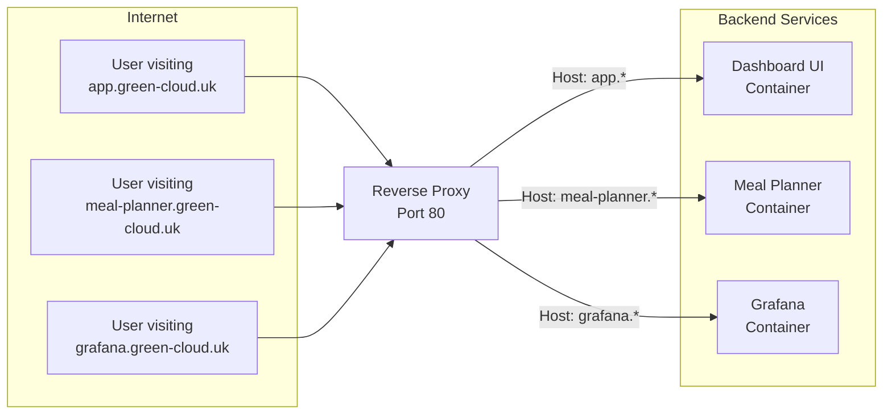
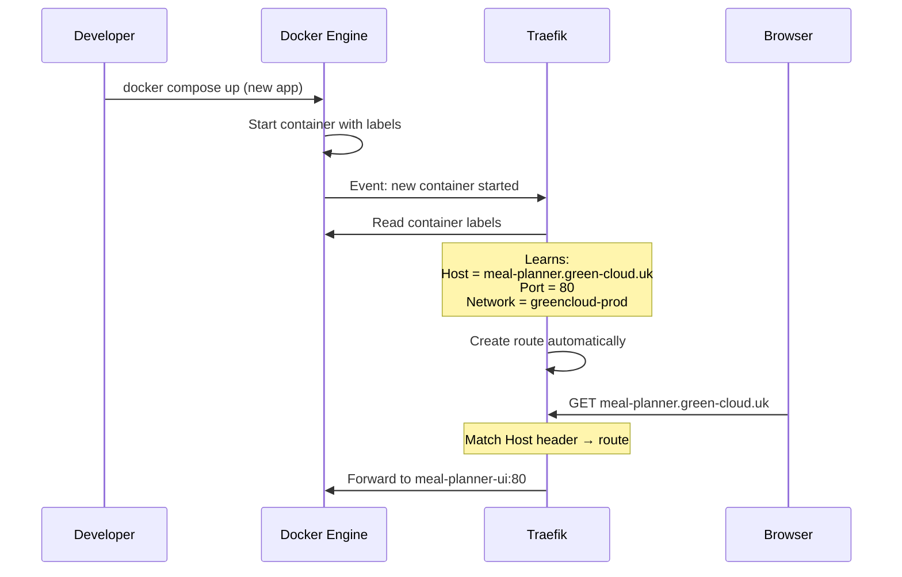
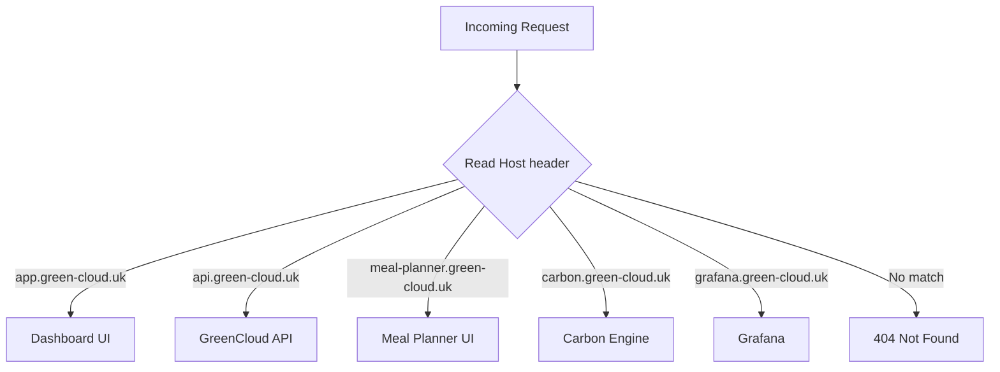
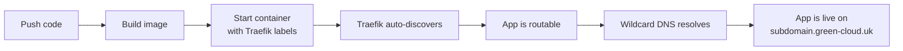

# Reverse Proxies and Traefik

This guide explains what a reverse proxy is, why every multi-service setup needs one, and how Traefik makes it almost effortless in GreenCloud.

## The Problem: Many Services, One Machine

GreenCloud runs 10+ web services on a single Raspberry Pi. Each one listens on a different port internally:

- GreenCloud API → port 8000
- Carbon Engine → port 8000 (different container, same port)
- Grafana → port 3000
- Dashboard UI → port 80
- Meal Planner → port 80

But from the outside, users visit URLs like `app.green-cloud.uk` and `meal-planner.green-cloud.uk`. They don't type port numbers. They all come in on port 80/443.

How does one machine know which service to send each request to?

## What is a Reverse Proxy?

A reverse proxy sits between the internet and your services. It receives all incoming requests and **routes them to the correct backend** based on rules you define.



Without a reverse proxy, you'd need to expose each service on a different port (`:8000`, `:8001`, `:3000`) and make users remember them. Or only run one service. Neither is practical.

### What "reverse" means

A regular (forward) proxy sits in front of **clients** — it makes requests on their behalf (like a VPN). A *reverse* proxy sits in front of **servers** — it receives requests and decides which server handles them. The "reverse" means it's on the server side, not the client side.

## Why Not Just Use Nginx?

Nginx is a popular reverse proxy, but it requires you to write configuration files for every service:

```nginx
# nginx.conf — you'd need to update this every time you add a service
server {
    server_name app.green-cloud.uk;
    location / {
        proxy_pass http://dashboard-ui:80;
    }
}

server {
    server_name meal-planner.green-cloud.uk;
    location / {
        proxy_pass http://meal-planner-ui:80;
    }
}

# Add another block for every new app...
# Then reload nginx: nginx -s reload
```

Every time you deploy a new app, you'd need to:
1. Edit the nginx config file
2. Reload nginx
3. Hope you didn't make a syntax error

This works, but it doesn't scale well for a PaaS where apps come and go.

## How Traefik Works

Traefik takes a different approach: **it discovers services automatically by watching Docker**.

Instead of a central config file, each container declares its own routing rules using Docker labels:

```yaml
# In docker-compose.yml — the container tells Traefik how to route to it
services:
  meal-planner-ui:
    image: meal-planner-ui:latest
    labels:
      - "traefik.enable=true"
      - "traefik.http.routers.meal-planner.rule=Host(`meal-planner.green-cloud.uk`)"
      - "traefik.http.services.meal-planner.loadbalancer.server.port=80"
```

That's it. No Traefik config files to edit. No reload commands. When this container starts, Traefik sees it immediately and starts routing traffic to it.

### The Docker Socket Connection

Traefik watches the Docker socket (`/var/run/docker.sock`) — this is the API that Docker exposes for managing containers. Through it, Traefik can:

1. See when new containers start
2. See when containers stop
3. Read labels on containers
4. Learn which networks containers are on



### What Happens When a Container Stops?

Traefik notices immediately (via the Docker socket) and removes the route. Requests to that subdomain will get a 404 until a new container with matching labels starts up.

## Host-Based Routing

The key routing mechanism is **host-based routing** — Traefik looks at the `Host` header in every HTTP request and matches it against rules.

Every HTTP request includes a `Host` header that says which domain the browser is trying to reach:

```
GET / HTTP/1.1
Host: meal-planner.green-cloud.uk
```

Traefik's routing rules match against this header:



You can also combine host matching with path matching. For example, the Dashboard uses:
- `Host(app.green-cloud.uk) && PathPrefix(/api)` → Dashboard API backend
- `Host(app.green-cloud.uk) && PathPrefix(/)` → Dashboard UI frontend

This means one subdomain can serve both a frontend and a backend, routed by URL path.

## Traefik's Configuration in GreenCloud

Traefik itself needs minimal configuration. Here's what GreenCloud uses:

```yaml
# traefik.yml (static config — rarely changes)
entryPoints:
  web:
    address: ":80"          # Listen on port 80

providers:
  docker:
    exposedByDefault: false  # Only route containers with traefik.enable=true
    watch: true              # Watch for new/removed containers in real-time

api:
  dashboard: true            # Enable the Traefik web dashboard
```

That's the entire static config. Everything else is dynamic — learned from container labels at runtime.

### The exposedByDefault: false Setting

This is important for security. Without it, Traefik would route to every running container. With it set to `false`, only containers that explicitly opt in with `traefik.enable=true` get a route. Internal services (like the database) stay hidden.

## How This Enables Zero-Config App Deployment

This is the magic of GreenCloud's deployment pipeline:

1. A user pushes code to GitHub
2. GreenCloud API clones the repo and builds Docker images
3. New containers are started with Traefik labels (subdomain, port)
4. Traefik instantly discovers them and creates routes
5. Cloudflare wildcard DNS already resolves `*.green-cloud.uk`
6. The app is live — no config files were edited, no services were restarted



Adding a new app to GreenCloud requires zero changes to Traefik's configuration. It's fully dynamic.

## Traefik Labels Reference

Here's what the common labels mean:

```yaml
labels:
  # Enable Traefik routing for this container
  - "traefik.enable=true"

  # Which Docker network to use for communication
  - "traefik.docker.network=greencloud-prod"

  # Routing rule — when to send traffic here
  - "traefik.http.routers.my-app.rule=Host(`my-app.green-cloud.uk`)"

  # Which Traefik entrypoint to listen on
  - "traefik.http.routers.my-app.entrypoints=web"

  # Which port the container listens on internally
  - "traefik.http.services.my-app.loadbalancer.server.port=8000"
```

## Traefik vs Other Reverse Proxies

| Feature | Nginx | Traefik | Caddy |
|---------|-------|---------|-------|
| Config style | Static files | Dynamic (Docker labels) | Static files (Caddyfile) |
| Auto-discovery | No (manual config) | Yes (Docker, Kubernetes, etc.) | No |
| Reload needed? | Yes, after config changes | No, real-time | Yes |
| Best for | Traditional setups | Container-based dynamic environments | Simple HTTPS hosting |
| GreenCloud fit | Would work, but manual | Perfect — apps come and go dynamically | Would work for static setups |

## Summary

- A **reverse proxy** routes requests from one entry point to many backend services
- **Traefik** discovers services automatically by watching Docker for container changes
- Containers declare their own routing rules via **Docker labels** — no central config to edit
- **Host-based routing** matches the domain name in the request to the correct container
- This makes **zero-config deployment** possible: start a container with the right labels and it's instantly reachable
- GreenCloud uses Traefik because apps are deployed and removed dynamically — a static config approach wouldn't scale
